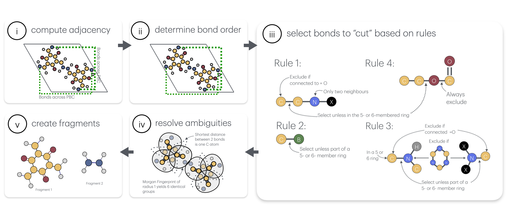

# deCOFposition

**deCOFpositon** The deCOFposition algorithm systematically decomposes periodic Covalent Organic Frameworks (COFs) into meaningful molecular fragments while preserving important chemical features (e.g., aromatic rings, π-conjugation). The workflow can be divided into five main steps:


i. Convert Periodic Structures to Finite Molecular Representations
Starting from a crystallographic file (CIF), cif2mol generates an expanded supercell, isolates the central unit cell, and maps atoms/bonds across periodic boundaries back to their corresponding positions in the central cell.

ii. Determine Bond Orders
deCOFpose infers bond types (single, double, etc.) based on atomic valencies, connectivity, and aromaticity.
Accurate bond order assignment is crucial because subsequent fragmentation rules rely on identifying specific bond environments (e.g., aromatic rings, carbonyls, etc.).
Bonds that cross arbitrary cell boundaries retain their correct bond order assignments.

iii. Select Bonds to “Cut” Using Chemical Rules
A set of default “cutting rules” guides the algorithm in identifying “suspicious” or cleavage-prone bonds, such as C–C bonds adjacent to doubly-substituted nitrogen, B–C bonds in boron-containing linkages, and various C–N and C–O bonds.
These rules are designed to avoid breaking key π-conjugated paths or cutting through small (5- or 6-membered) aromatic or heterocyclic rings, thereby preserving the continuity of electronic structures where relevant.

iv. Resolve Ambiguities
Sometimes multiple possible bonds can be cut according to the rules, which can lead to inconsistent fragmentation if handled randomly.
deCOFpose groups similar candidate bonds, constructs a graph of connectivity between them, and searches for symmetrical routes (e.g., triangles in the bond graph).
When such symmetries are found, they are consistently treated to maintain systematic and chemically meaningful fragment sets.

v. Finalize and Output Fragments
After ambiguities are resolved, the identified “suspicious” bonds are cleaved, generating discrete molecular fragments (or building blocks).
These fragments can be further characterized, visualized, or used in subsequent analyses (e.g., property predictions, etc.).




## Folder and File Structure

```plaintext
.
├── 447.cif
├── core.xyz
├── deCOFpose_explanation.ipynb #examlpe how to use the deCOFposition
├── l_n_test/                  # Folder for output images 
├── periodic_smiels.py         # Script for generating/manipulating periodic SMILES
├── utils_pbc.py               # Helper functions for periodic boundary conditions
├── utils.py                   # General utilities (e.g., xyz2AC, AC2mol, etc.)
├── chem_rules.py              # Contains BaseRule and rule child classes (Rule1, Rule2, Rule3, Rule5, etc.)
├── chouse_bonds.py            # Script for bond selection (applies rules from chem_rules.py)
├── cif2mol.py                 # Converts cif to an rdkit object
├── mini_tools.py              # Utility scripts for reading/writing data
└──deCOFpose_explanation.ipynb# Jupyter Notebook demonstrating code usage
```


## Implementing Custom Rules

You can easily add custom rules to the analysis pipeline. For example, to create a new rule just subclass the BaseRule Class


```python
class RuleX(BaseRule):
    def __init__(self):
        super().__init__(rule_name="RuleX")

    def _bond_matches_rule(self, rwmol, bond,
                           exclusive_largest_ring_bonds,
                           largest_ring_bonds,
                           smallest_ring_bonds):
        atom1 = bond.GetBeginAtom()
        atom2 = bond.GetEndAtom()
        # Example condition: double-bonded carbon-oxygen in a 7-membered ring
        if ((atom1.GetAtomicNum() == 6 and atom2.GetAtomicNum() == 8) or
            (atom1.GetAtomicNum() == 8 and atom2.GetAtomicNum() == 6)):
            if bond.GetBondType() == Chem.rdchem.BondType.DOUBLE:
                if bond.IsInRingSize(7):
                    return True
        return False

    def _update_atom_props(self, rwmol, bond):
        a1 = bond.GetBeginAtom()
        a2 = bond.GetEndAtom()
        # Optionally, set custom flags: always mark O as used=1, C as used=2
        if a1.GetAtomicNum() == 8:
            a1.SetUnsignedProp("used", 1)
            a2.SetUnsignedProp("used", 2)
        else:
            a1.SetUnsignedProp("used", 2)
            a2.SetUnsignedProp("used", 1)
        a1.SetProp("rule", self.rule_name)
        a2.SetProp("rule", self.rule_name)
```
```